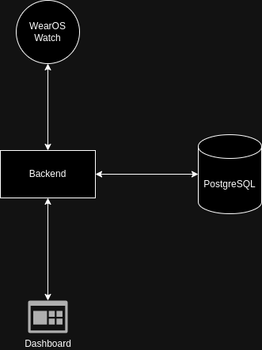

## Sleepwalker

Sleep monitoring and sleepwalking detection & prevention system.

---

### Modules
- [WearOS app](https://github.com/zNitche/sleepwalker-wearos)
- [Backend](https://github.com/zNitche/sleepwalker-backend)
- [Dashboard](https://github.com/zNitche/sleepwalker-frontend)

### Features
- Gathering body sensors data (Heart beat, movement).
- Gathering environment sensors data (temperature, humidity).
- Sleepwalking detection + prevention (watch vibrations).
- Collected data preview and management.

### High Level Diagram

### Flow
1. `WearOS` app starts new logs session and sends body telemetric data to backend.
2. `Backend` starts celery task to analyze data and check if sleepwalking occured.
3. If sleepwalking has been detected, watch starts vibrating.
4. Session can be reset by `WearOS` app or `Dashboard`.
5. Sessions and sessions data can be viewed & managed in `Dashboard` panel.
